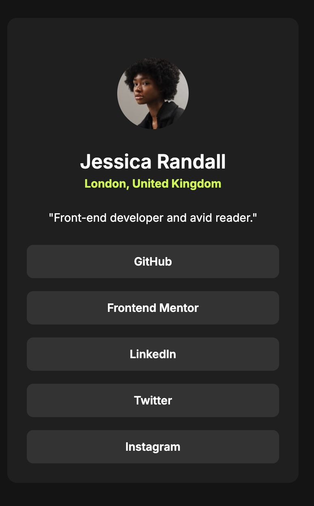

# Frontend Mentor - Social links profile solution

This is a solution to the [Social links profile challenge on Frontend Mentor](https://www.frontendmentor.io/challenges/social-links-profile-UG32l9m6dQ). Frontend Mentor challenges help you improve your coding skills by building realistic projects.

## Table of contents

- [Overview](#overview)
  - [The challenge](#the-challenge)
  - [Screenshot](#screenshot)
  - [Links](#links)
- [My process](#my-process)
  - [Built with](#built-with)
  - [What I learned](#what-i-learned)
- [Author](#author)


## Overview

### The challenge

Users should be able to:

- See hover and focus states for all interactive elements on the page

### Screenshot




### Links

- [Solution URL](https://github.com/edpau/fm_social_links_profile_main)
- [Live Site URL](https://edpau.github.io/fm_social_links_profile_main/)

## My process

### Built with

- Semantic HTML5 markup
- Flexbox
- Mobile-first workflow


### What I learned

#### html- accessibility

###### Using `aria-label` for External Links

```html
<a
  href="https://github.com"
  class="button"
  target="_blank"
  rel="noopener noreferrer"
  aria-label="GitHub (opens in a new tab)"
  >GitHub</a
>
<a
  href="https://www.frontendmentor.io"
  class="button"
  target="_blank"
  rel="noopener noreferrer"
  aria-label="Frontend Mentor (opens in a new tab)"
  >Frontend Mentor</a
>
```

###### Background of the Use Case:

- Social Media Profile Links: A webpage displays links to various social media profiles (GitHub, LinkedIn, Twitter, etc.).
- Links Open in a New Tab: Each link opens in a new browser tab when clicked, which is a behavior that users should be informed about for better accessibility.
- Clean UI Design: The design aims to be clean and uncluttered, avoiding redundant visible text that could overwhelm sighted users.
  
###### Why We Need to Use aria-label:
- Informing Screen Reader Users: aria-label provides essential information to screen reader users, letting them know both the purpose of the link and that it opens in a new tab.
- Accessibility Enhancement: Ensures that users with visual impairments understand the behavior of the links without needing to see visible text.
- Avoiding Visible Clutter: Keeps the UI clean by avoiding extra text like "(opens in a new tab)" in the visible link labels, while still conveying this information through aria-label.
- Consistency Across Links: Provides a uniform experience across all links, making the webpage easier to navigate for users relying on assistive technologies.
- Better than title Attribute: More reliably supported by screen readers compared to the title attribute, ensuring the information is conveyed effectively.

#### html- secuirty
##### `rel="noopener noreferrer"` prevent "reverse tabnabbing" attack when using target=“_blank”
```html
<a
  href="https://github.com"
  class="button"
  target="_blank"
  rel="noopener noreferrer"
  aria-label="GitHub (opens in a new tab)"
  >GitHub</a
>
```
- Security and Performance: When using target="_blank" to open links in a new tab, the newly opened tab retains a connection back to the original page via the window.opener object. This can pose a security risk because the new tab can potentially manipulate the original page's content or redirect it to a malicious site.
- rel="noopener": Adding rel="noopener" prevents the new tab from gaining access to the window.opener object, effectively cutting the connection between the original page and the new tab. This improves security by protecting the original page from potential malicious actions.
- rel="noreferrer": Adding rel="noreferrer" alongside noopener also ensures that no referral information (i.e., the URL of the original page) is sent to the new tab, further enhancing privacy.
- The Problem: This vulnerability, known as the "reverse tabnabbing" attack, can be exploited by attackers to trick users or hijack the original page. Using rel="noopener noreferrer" mitigates this risk, ensuring safer browsing for users.


## Author

- Website - [Edward Pau](https://www.your-site.com)
- Frontend Mentor - [@edpau](https://www.frontendmentor.io/profile/edpau)


